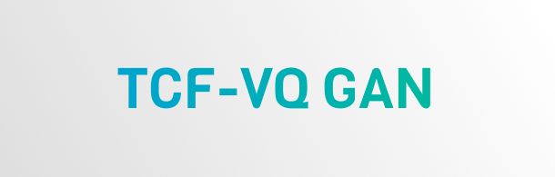

### 🛰️ TCF-VQ GAN PyTorch 实现

### ⚙️ 环境安装

建议先到 PyTorch 官网手动安装 `torch` 和 `torchvision`：[PyTorch Started](https://pytorch.org/get-started/locally/)。本文使用的环境版本为 `2.6.0+cu126`。完成 PyTorch 安装后，其余依赖可通过以下命令安装：

```bash
pip install -r requirements.txt
```

如果环境中已经安装了部分依赖，也可以直接补齐缺失项。

### 📦 数据集目录

#### 🛰️ SEN12MS-CR

SEN12MS-CR 按照以下结构组织数据。训练、验证和测试集分别放在 `train`、`val` 和 `test` 目录下，每个样本由输入 SAR、云污染光学影像以及对应标签组成。

```text
SEN12MS-CR/
├── train/
│   ├── input_s1/
│   │   ├── ROIs1158_spring_s1_1_p88.tif
│   │   ├── ...
│   │
│   ├── input_s2_cloudy/
│   │   ├── ROIs1158_spring_s2_cloudy_1_p88.tif
│   │   ├── ...
│   │
│   └── label/
│       ├── ROIs1158_spring_s2_1_p88.tif
│       ├── ...
│
├── val/
│
└── test/
```

#### 🌍 SMILE-CR

下载 [SMILE-CR](https://www.kaggle.com/datasets/yuxiawhu/smile-cr/data) 解压使用。`TrainData`、`ValData` 和 `TestData` 分别对应训练、验证和测试阶段，内部数据保持原始子目录结构。

```text
SMILE-CR/
├── TrainData/
│   ├── CloudLandsat_2020/
│   ├── Landsat-8_2020/
│   ├── Mask/
│   ├── MODIS_2020/
│   └── Sentinel-1_2020-De/
│
├── ValData/
│
└── TestData/
```

### 🚀 训练

模型采用配置文件驱动的方式，整体流程如下。

1. 在 `configs/SEN12MS_CR` 或 `configs/SMILE_CR` 文件夹下的 `HQD.yaml` 和 `VQGAN.yaml` 中，将 `data -> params -> train|val|test -> params -> path` 分别填写为数据集路径。

   例如，SEN12MS-CR 写为：

   ```text
   PATH_TO_DATASET/SEN12MS-CR-5K/train
   PATH_TO_DATASET/SEN12MS-CR-5K/val
   PATH_TO_DATASET/SEN12MS-CR-5K/test
   ```

   SMILE-CR 写为：

   ```text
   PATH_TO_DATASET/SMILE-CR/TrainData
   PATH_TO_DATASET/SMILE-CR/ValData
   PATH_TO_DATASET/SMILE-CR/TestData
   ```

2. 阶段 I 训练：在 `main.py` 第 110 行填写 `HQD.yaml` 的配置文件路径，例如：

   ```python
   config = OmegaConf.load("configs/SMILE_CR/HQD.yaml")
   ```

   然后运行 `python main.py`。

3. 阶段 II 训练：将阶段 I 的最佳 `.ckpt` 填入 `VQGAN.yaml` 中的 `model -> params -> ckpt_path`，并将 `main.py` 第 110 行切换为 `VQGAN.yaml`，例如：

   ```python
   config = OmegaConf.load("configs/SMILE_CR/VQGAN.yaml")
   ```

   然后运行 `python main.py`。第二阶段对生成质量进行细化优化。

4. 指标计算可参考 `test.ipynb` 中的 cell 1 和 cell 2，Notebook 给出了基本的评估流程，便于复用或按需修改。

### 感谢

感谢以下项目的开源实现与启发：

- [RestoreFormerPlusPlus](https://github.com/wzhouxiff/RestoreFormerPlusPlus)
- [generative_inpainting](https://github.com/JiahuiYu/generative_inpainting)
